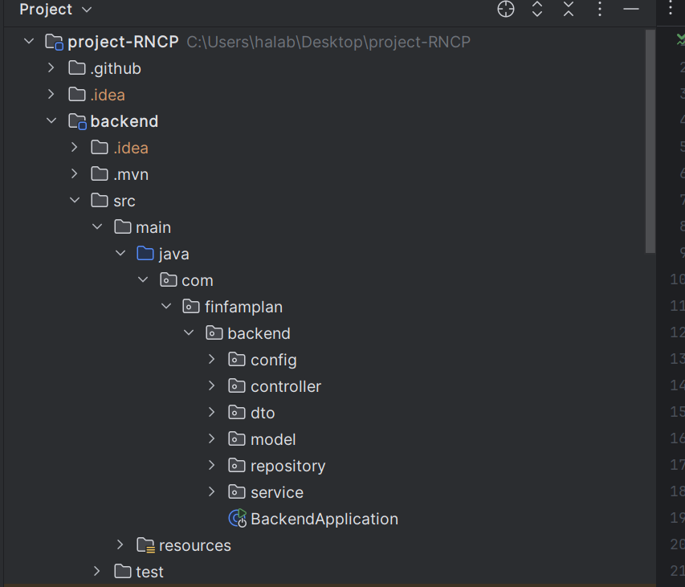
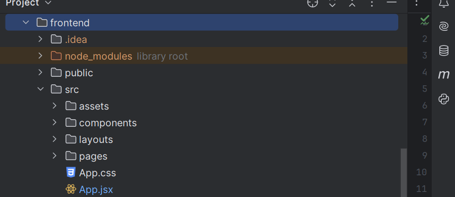
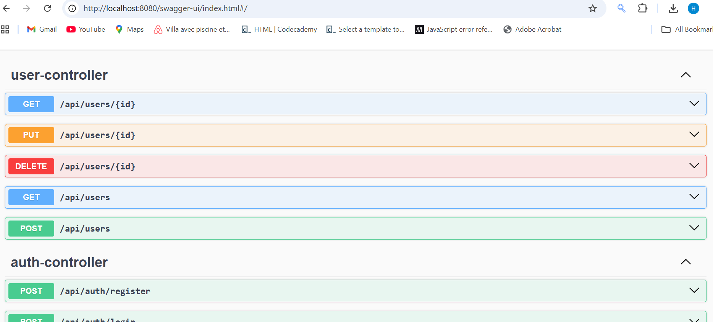

## 🚀 FinFamPlan

FinFamPlan est une application **full-stack de gestion financière familiale**.  
Elle permet l’inscription, la connexion, la gestion de session et un écran d’accueil personnalisé pour les nouveaux utilisateurs.

🎯 **Objectif final** : accompagner les familles dans la gestion de leur budget, de leurs dépenses et de leurs objectifs financiers.

---

## 🧱 Architecture du Projet

Vue globale de l’architecture technique :

```text
┌──────────────────────────────────────────┐
│                FRONTEND                  │
│         React + Vite + TailwindCSS       │
└──────────────────────────┬───────────────┘
                           │ REST API
                           ▼
┌──────────────────────────────────────────┐
│                BACKEND                   │
│               Spring Boot                │
│     Controllers — Services — Repos       │
│  Security: Spring Security + Argon2      │
│  Flyway: DB migrations                   │
└──────────────────────────┬───────────────┘
                           │ JDBC
                           ▼
┌──────────────────────────────────────────┐
│               POSTGRESQL                 │
│               Database                   │
└──────────────────────────────────────────┘
```
---
## 📦 Fonctionnalités Actuelles

🔐 Authentification

- Inscription utilisateur
- Connexion (email + mot de passe)
- Stockage sécurisé des mots de passe avec Argon2 (OWASP recommandé)
  - Redirection automatique :
      -Première connexion → Welcome Page
      -Connexions suivantes → Dashboard

🎨 Frontend

    - React + Vite
    - TailwindCSS
    - Design basé sur Atomic Design
        atoms / molecules / organisms / layouts / pages
    - UI responsive
    - Communication frontend ↔ backend fonctionnelle
    - Routing protégé (préparation pour JWT)

🐳 DevOps

- Projet entièrement dockerisé avec Docker Compose
-     Services :
        Frontend
        Backend
        PostgreSQL
- CI/CD avec GitHub Actions
        Build backend
        Tests backend
        Build frontend
---
## 🛠️ Installation & Lancement

    ▶️ Lancer avec Docker
        docker-compose up --build
    Accès aux services :
        Frontend → http://localhost:5173
        Backend → http://localhost:8080
        PostgreSQL → localhost:5432
    ⏹️ Arrêter les services
        docker-compose down
---
## 💾 Structure du Projet
### Backend
<p align="center">  </p>

### Frontend
<p align="center">  </p>

---
## 💾 Documentation API


---
# 🤝 Contributeur

👤 Hala Chaouat
